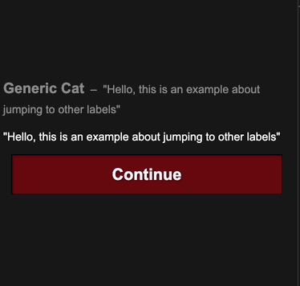

# Jump

## Jump Function

The `jump` function allows you to jump to a `label`. Labels are how you break down your scripts in reuseable and manageable chunks. You can jump from any file to a label in any other file.

::: tip
Jumping to a label will save the game. Saving is only done on label jump, because it makes saves able to handle game updates.

For example, if narrat tried to keep track of which specific line of dialogue the player is at, but after a game update that dialogue line was gone, it would break.

By using labels, we can save the last label that was reached and guarantee that it will still be there next time (as long as you don't delete the whole label from your script!)
:::

## Example

Running this code will play the script inside `jump_example`, then run the script inside `label_to_jump`

```narrat
label_to_jump:
    talk cat idle "The code has now jumped to this label"

jump_example:
    talk cat idle "Hello, this is an example about jumping to other labels"
    talk cat idle "Use the jump command to jump to a different label in any of your scripts"
    jump label_to_jump
```


