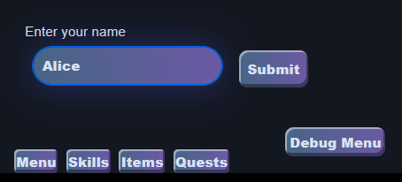
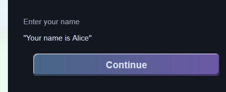

# Text Field

#### New feature: Text Fields

New text fields feature to let players type answers to questions.

Usage: `text_field [prompt]`

Example:

```narrat
main:
  set player.name (text_field "Enter your name")
  "Your name is %{playerName}"
```




