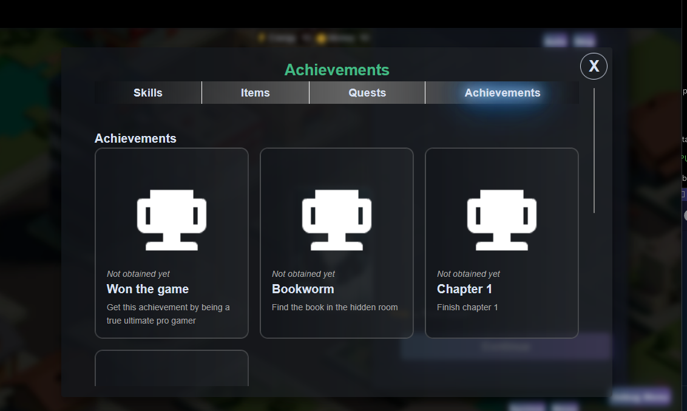

# Achievements

The achievements system allows players to unlock achievements, which appear in their own UI.

Possible achievements can be defined in a `achievements.yaml` file:

```yaml
categories:
  - id: default
    title: Achievements
  - id: secret
    title: Secret Achievements

defaultAchievementIcon: img/achievements/trophy.png

achievements:
  win_game:
    name: Won the game
    description: You got this achievement by being a true ultimate pro gamer
    icon: img/items/bread.webp
  secret_achievement:
    name: Secret boss found
    description: You beat the secret boss
    icon: img/items/book.webp
    secret: true
    category: secret

notifyNewAchievements: true

secretAchievements:
  censorDescription: true
  censorName: false
  hideUntilObtained: false
```

The location of `achievements.yaml` should be set in `config.yaml`:

```yaml
achievements: data/achievements.yaml
```

Then achievements can be unlocked in game scripts:

```yaml
main:
  "There is a boss"
  choice:
    "Kill the boss?"
    "Yes":
      "You kill the boss"
      unlock_achievement win_game
    "No, run away":
      "You run away"
```

## Achievements UI

The achievements UI will automatically appear as a tab in the game menu if the game has any achievements defined.


