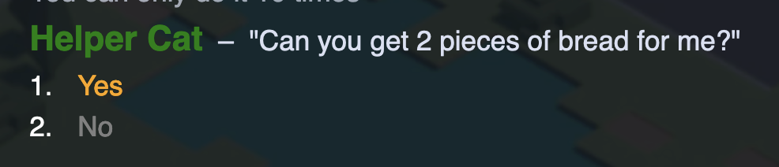
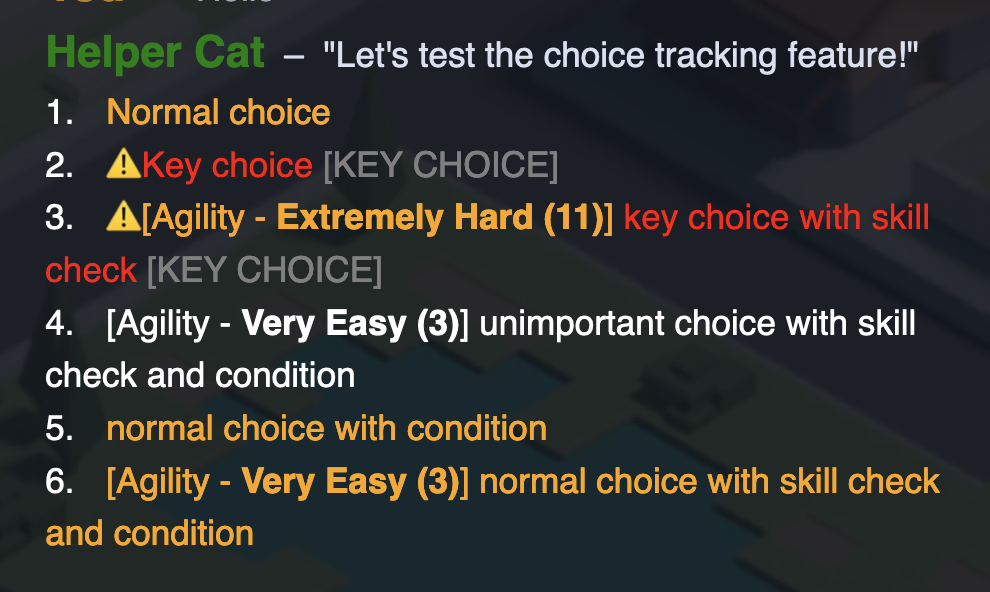

# Branching dialogue and choices

## Branching dialogue and choices

Narrat is built around branching dialogue and choices. You can use conditions in your script to play different dialogue depending on what's happening, and players can also make choices.

## Choice Function

The choice function is what allows players to make decisions. For example:

```narrat
choice_example:
  choice:
    talk helper idle "What do you want to eat?"
    "I want a burger":
      talk helper idle "Here's your burger"
    "I want a pizza":
        talk helper idle "Here's your pizza"
```

More about the choice function [there](../commands/choice-function.md).

## Conditions

Conditions are used to control whether a line of dialogue should be played or not. The most common way to do conditions is to use the `if` command. For example:

```narrat
condition_example:
  set data.player.evil true
  if $data.player.evil:
    talk shopkeeper idle "Get away from me you monster!"
  else:
    talk shopkeeper idle "Hello, would you like to buy a potion?"
```

More about conditions [there](../commands/if-function.md).

## Choice tracking

Narrat tracks which choices the player has seen. When a dialog choice has been seen before, it adds the `.seen-before` css class to the dialogue option.



This allows the game to display previously seen choices in a different color or style, to make it obvious what options have been visited.

::: tip
You can override the `seen-before` css class to change how seen choices are displayed.
:::

## Choice flags and choices config file

It is possible to customise how choices are displayed in narrat, by creating a `choices.yaml` config file.

For example:

```yaml
# Basic text template that will override the default one in narrat
choiceTextTemplate: '[%{$index}] <span class="choice-text">%{$choice}</span>'
choicePrompts:
  # Specific choice flags to display different types of choices differently
  KEY:
    # Each choice flag can have its own text template
    textTemplate: '<span class="choice-index key-choice-index">%{$index}. </span>⚠️%{$choice} <span style="color:grey;">[KEY CHOICE]</span>'
    # Each choice flag can specify a css class which will be added to the choice line
    cssClass: 'key-choice'
  UNIMPORTANT:
    cssClass: 'unimportant-choice'
```

In this config file you can add any amount of choice prompt IDs, allowing the creation of all sorts of custom choice prompt styles.

Here is a simple usage example:

```narrat
main:
  choice:
  "Let's look around the room"
  "Inspect the table":
    "You inspect the table"
  "Look at the stack of papers":
    "You search through the stack of papers"
  KEY "Move on to the next room":
    "You move on to the next room"
    jump next_room
```

For a more complicated usage example, this snippet of narrat code was used for testing the feature:

```narrat
test_choice_tracking:
  choice:
    talk helper idle "Let's test the choice tracking feature!"
    "Normal choice":
      talk helper idle "Choice 1"
    KEY "Key choice":
      talk helper idle "Normal key choice"
    KEY roll testSkillCheck agility 14 "key choice with skill check":
      success:
        talk helper idle "Key choice with skill check"
      failure:
        "failure"
    UNIMPORTANT roll testDicePool "unimportant choice with skill check and condition" if (== true true):
      success:
        talk helper idle "Key choice with skill check and condition"
      failure:
        talk helper idle "Failure"
    "normal choice with condition" if (== true true):
      talk helper idle "Key choice with condition"
    roll testDicePool "normal choice with skill check and condition" if (== true true):
      success:
        talk helper idle "Key choice with condition and skill check"
      failure:
        talk helper idle "Failure"
  jump test_choice_tracking_2


test_choice_tracking_2:
  "Now the choices already picked should be greyed"
  jump test_choice_tracking
```

Here's what it looks like in the game (yes it's ugly, this is meant to be an example of the feature):


