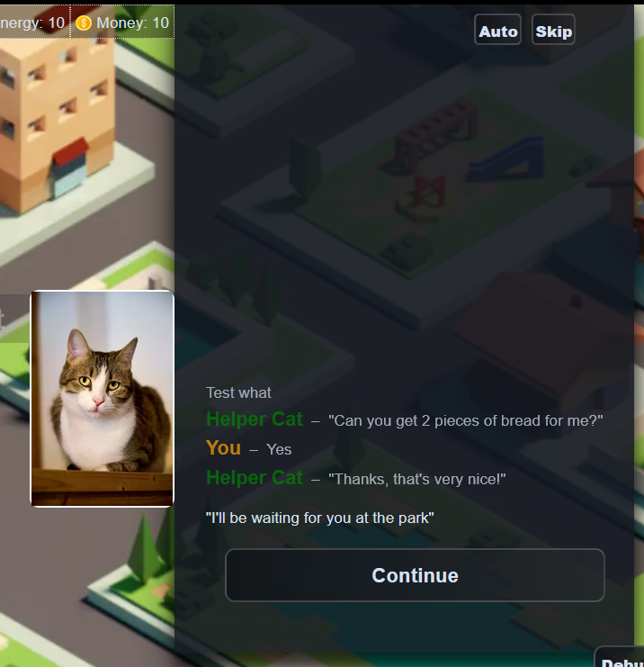

# The Dialog Panel

The Dialog Panel is where all the text in the game appears. When characters talk, the dialog panel opens, and shows what they say. It is also where the player can make choices and advance in the story.

The dialog panel is where most of the content of a Narrat game usually takes place, while the viewport below it is where visuals are displayed. Sometimes the viewport can have clickable buttons or sprites, but most of the interaction tends to take place in the dialog panel.



## How the dialog panel works

Whenever the game is **doing something** (that is, running narrat script), the dialog panel will appear. If the narrat script ends, the dialog panel will close.

::: NOTE
This doesn't apply to games in overlay mode, or on mobile, where the dialog panel is always visible.
:::

## Dialog panel config options

The dialog panel has the following options available, which are set in the `dialogPanel` part of `config.yaml`:

```yaml
textSpeed: 30
animateText: true
timeBetweenLines: 100
overlayMode: true
rightOffset: 100
bottomOffset: 50
width: 475
height: 680
hideDuringTransition: false
showAfterScriptEnd: false
showOldChoices: false
showChoiceOutcomes: true
lockSeenChoices: false
allowSpacebarInChoices: false
```

- `textSpeed`: [number] The speed at which text appears in the dialog panel, in characters per second. Defaults to 30. If `animateText` is off, this still controls the speed of auto play. Players can override this setting in the system menu
- `animateText`: [boolean] Whether text should appear one character at a time. Defaults to true. Players can override this setting in the system menu
- `timeBetweenLines`: [number] Time to wait between two lines of dialog in auto mode
- `overlayMode`: [boolean] Whether the dialog panel should be in overlay mode. Defaults to true. Overlay mode means that the dialog panel will appear on top of the viewport. In games where overlay mode is off, the dialog panel is instead to the side of the viewport
- `rightOffset`: [number] How far from the right edge of the screen the dialog panel should be, in pixels.
- `bottomOffset`: [number] How far from the bottom edge of the screen the dialog panel should be, in pixels.
- `width`: [number] The width of the dialog panel, in pixels.
- `height`: [number] The height of the dialog panel, in pixels.
- `hideDuringTransition`: [boolean] Whether the dialog panel should be hidden during screen transitions. Defaults to true.
- `showAfterScriptEnd`: [boolean] Whether the dialog panel should stay on even if the narrat script ends. Defaults to false.
- `showOldChoices`: [boolean] [optional] [default: false] If turned on, choice options for past choices will appear in the dialog history instead of being deleted
- `showChoiceOutcomes`: [boolean] [optional] [default: true] If turned on, narrat will automatically print and autocontinue the choice option selected by the player.
- `lockSeenChoices`: [boolean] [optional] [default: false] If turned on the player will be unable to access choices they have already taken, even when they return to a menu.
- `allowSpacebarInChoices`: [boolean] [optional] [default: false] If turned on the spacebar will select the first choice in a list of choices. Note that debug mode overrides this behaviour to make it easy to quickly skip through dialogue.

## Controlling when the dialog panel appears

The default behaviour of the dialog panel should be good enough for most games, but if your game needs finer control of it, there are a few ways to control it:

The two config options `hideDuringTransition` and `showAfterScriptEnd` allow you to control whether the dialog panel should be hidden during screen transitions, and whether it should stay on even if the narrat script ends.

You can also use the `set_dialog_panel_mode` command to manually force the dialog panel on or off:

```narrat
test_set_dialog_panel_mode:
  choice:
    "Which mode":
    "Auto (normal default behaviour)":
      set_dialog_panel_mode auto
    "Force always on":
      set_dialog_panel_mode on
    "Force always off (will go back on after a timer for testing)":
      set_dialog_panel_mode off
      wait 1500
      set_dialog_panel_mode auto
  jump test_set_dialog_panel_mode
```
