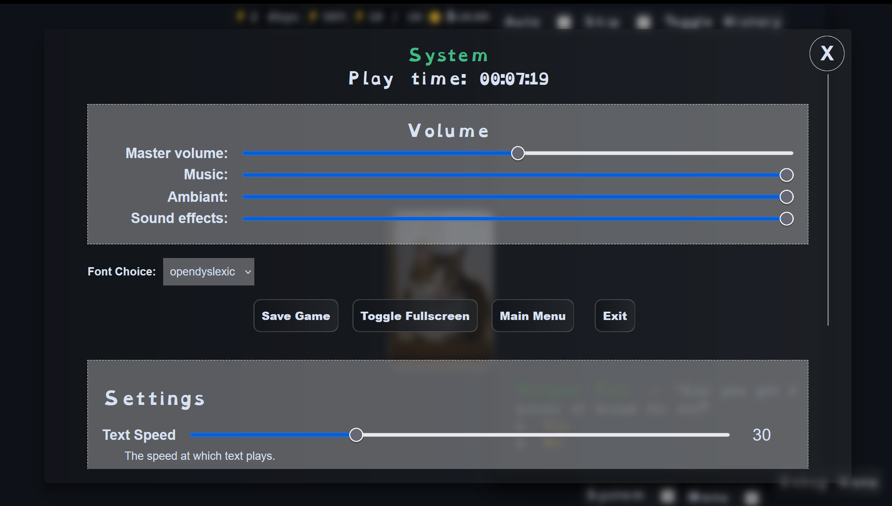
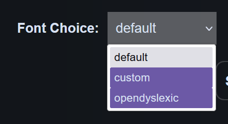

# {{ $frontmatter.title }}



## Font Sets

Narrat can let players choose their preferred font in the system menu. To that end, the game can define sets of fonts to be picked from. Each set is made of a header font and a body font.

To setup font sets, create `fonts.yaml` in the `config` folder, and add it to the list of config files being imported in `config/index.ts`.

When there are multiple font sets, the option to choose a font will appear in the system menu:



## Configuring font sets

The fonts config file contains a `fontSets` object where each set of font is named. The `default` set is required if using this feature and should contain whatever font you want to use when the game first load. Other font sets can have any name (here: `custom` and `opendyslexic`).

Within each set, there are different fonts to specify. At the moment narrat only needs `header` and `body` fonts. Each font needs a few properties:

- `name`: The CSS font family name of the font. This is the name that will be used in CSS to refer to the font.
- `fontFamily`: The CSS font family string to use in CSS. This is what will be used as the `font-family` property when the engine uses this font
- `files`: An array of font files to load. Each font needs at least one file, and the file can either just be a string, or an object which passes additional options (necessary for fonts that have separate files for bold, italics, etc):

If a font has multiple files and needs to pass options, then the format is:

- `file`: URL of the font file
- `options`: An object with options to pass to the font. See [Font face options](https://developer.mozilla.org/en-US/docs/Web/API/CSS_Font_Loading_API#defining_a_font_face).

The default game template comes with a few fonts already setup as an example:

```yaml
allowChoosingFont: true
fontSets:
  default:
    header:
      name: Baskervville SC
      fontFamily: '"Baskervville SC", serif'
      files: ['fonts/Baskervville_SC/BaskervvilleSC-Regular.ttf']
    body:
      name: 'Montserrat'
      fontFamily: '"Montserrat", sans-serif'
      files:
        - file: 'fonts/Montserrat/Montserrat-VariableFont_wght.ttf'
          options: {}
        - file: 'fonts/Montserrat/Montserrat-Italic-VariableFont_wght.ttf'
          options:
            style: italic
  custom:
    header:
      name: Nerko One
      fontFamily: '"Nerko One", cursive'
      files: ['fonts/Nerko_One/NerkoOne-Regular.ttf']
    body:
      name: 'Sevillana'
      fontFamily: '"Sevillana", cursive'
      files: ['fonts/Sevillana/Sevillana-Regular.ttf']
  opendyslexic:
    header:
      name: 'OpenDyslexic'
      fontFamily: '"OpenDyslexic", sans-serif'
      files:
        - file: 'fonts/OpenDyslexic/OpenDyslexic-Regular.woff2'
          options:
            weight: 400
        - file: 'fonts/OpenDyslexic/OpenDyslexic-Bold.woff2'
          options:
            weight: 700
        - file: 'fonts/OpenDyslexic/OpenDyslexic-Italic.woff2'
          options:
            style: italic
        - file: 'fonts/OpenDyslexic/OpenDyslexic-Bold-Italic.woff2'
          options:
            weight: 700
            style: italic
    body:
      name: 'OpenDyslexic'
      fontFamily: '"OpenDyslexic", sans-serif'
      files:
        - file: 'fonts/OpenDyslexic/OpenDyslexic-Regular.woff2'
          options:
            weight: 400
        - file: 'fonts/OpenDyslexic/OpenDyslexic-Bold.woff2'
          options:
            weight: 700
        - file: 'fonts/OpenDyslexic/OpenDyslexic-Italic.woff2'
          options:
            style: italic
        - file: 'fonts/OpenDyslexic/OpenDyslexic-Bold-Italic.woff2'
          options:
            weight: 700
            style: italic
```

## How fonts are used

The fonts set the following CSS variables within `#narrat`:

- `--font-body`: The body font family
- `--font-header`: The header font family

Adding new keys to the `fontSets` object will automatically create matching `--font-[name]` CSS variables, too.

Then, in the narrat CSS, the `font-family` property is set to these variables in the relevant places (`font-body` is set at the top level, and `font-header` is set on all header tags).

::: tip
If you are using [custom fonts in CSS](../guides/using-custom-fonts.md) in your own CSS, you may need to think about how these two features might clash
:::
