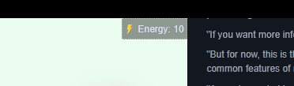

# HUD Stats

HUD Stats are number values that automatically appear in the HUD at the top right of the screen and can be controlled via game scripts.



## HUD Stats config

```yaml
hudStats:
  money:
    icon: img/ui/money.webp
    name: Money
    startingValue: 10
    minValue: 0
  energy:
    icon: img/ui/energy.webp
    name: Energy
    startingValue: 10
    minValue: 0
    maxValue: 10
```

Stats are defined in the `hudStats` part of the config.

- `icon:` path to an image to use as the icon for the stat
- `name`: The name of the stat for display in the HUD
- `startingValue`: The default value for the stat on a new save
- `minValue [optional, default 0]`: How low this stat can go
- `maxValue [optional]`: How high this stat can go
- `decimals [optional, default 2]`: Number, how many decimals to keep when rounding the stat value
- `prefix [optional]`: A prefix to add before the stat value when displaying it. If there is neither a prefix or a suffix, the name will be shown before the stat value
- `suffix [optional]`: A suffix to add after the stat value when displaying it. If there is neither a prefix or a suffix, the name will be shown before the stat value
- `hideName [optional, default false]`: If set to true, the curreny name will not be shown, regardless of whether there is a prefix or suffix
- `formatting [optional]`: See next section

## Advanced formatting

Using [styling options](https://developer.mozilla.org/en-US/docs/Web/JavaScript/Reference/Global_Objects/Intl/NumberFormat/NumberFormat#options) of web standard `Intl.NumberFormat`, stats can automatically be formatted in a few common formats via the `formatting` option.

If the `formatting` option is present, it needs to be an object with at least a `style` value. The following styles are supported: `decimal` (default), `currency`, `percent`, `unit`.

- `currency`: If style is set to `currency`, then the [`currency`](https://developer.mozilla.org/en-US/docs/Web/JavaScript/Reference/Global_Objects/Intl/NumberFormat/NumberFormat#currency_2) option can be provided in the `formatting` object to choose a currency. Default is USD.
- `unit`: If style is set to `unit`, then the [`unit`](https://tc39.es/ecma402/#table-sanctioned-single-unit-identifiers) option can be provided in the `formatting` object to choose a unit. Default is `day`.
- `percent`: There is nothing special to do for this one, but the number should be between 0 and 1.

### Examples of advanced formatting

::: details

```yaml
hudStats:
  money:
    icon: img/ui/money.webp
    name: Money
    startingValue: 10
    minValue: 0
    maxValue: 99999
    decimals: 2
    hideName: true
    formatting:
      style: currency
      currency: USD
  energy:
    icon: img/ui/energy.webp
    name: Energy
    startingValue: 10
    minValue: 0
    maxValue: 10
    suffix: ' / 10'
    decimals: 0
  percent:
    icon: img/ui/energy.webp
    name: percent
    hideName: true
    startingValue: 0.5
    minValue: 0
    maxValue: 1
    formatting:
      style: percent
  days:
    icon: img/ui/energy.webp
    name: days
    startingValue: 2
    minValue: 0
    maxValue: 7
    hideName: true
    formatting:
      style: unit
      unit: day
```

:::

### Functions

[stats](../commands/stats/)
