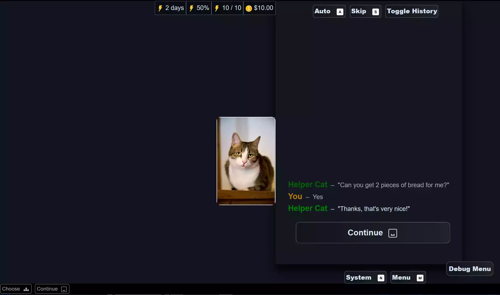
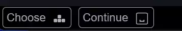

# {{ $frontmatter.title }}



Narrat shows input prompts for gamepad and keyboard shortcuts in the game UI. These prompts can be customised in the common config file.

## Input Legend

The input legend is an always-on list of input prompts at the bottom of the screen which shows generic controls.



## Input prompts

Individual input prompts appear in various relevant bits of the UI:


## Configuration

All those values default to true if not included

```yaml
input:
  showPromptsOnGamepad: true
  showPromptsOnKeyboard: true
  showBottomLegend: true
```

- `showPromptsOnGamepad`: Show input prompts when using a gamepad
- `showPromptsOnKeyboard`: Show input prompts when using a keyboard
- `showBottomLegend`: Show the input legend at the bottom of the screen

## Assets


At the moment the assets are hardcoded. To customise input prompt images, simply replace the images in `public/img/ui/button-prompts/`. There is a folder for gamepad and one for keyboard.

Some of the images are unused at the moment but are there for future use. For example most keyboard keys are currently unused.

Default input prompts are included with the game template and come from the great [Kenney input prompts](https://www.kenney.nl/assets/input-prompts) asset pack. Assets are 64x64 png, though you are free to make them bigger.

::: danger
Make sure to keep the exact same file names and format (png) when replacing input prompts.
:::

## CSS

All input prompts are rendered by the same component in the UI with the following structure:

- `<span>` tag with the css class `input-prompt-container`
  - `<span>` tag with the css class `input-prompt-label` (optional, some prompts show the icon without text)
  - `` tag with the css class `input-prompt-icon`

The prompts are displayed inline with a size of `1.4em`. `em` units are relative to the parent's font size, so this allows button prompts to automatically match the size of the text they are next to.

## Adding input prompts to an existing game before the update

If your game project started before the input prompts feature was added (3.15.0), you will need to manually add input prompt icons to your game.

The simplest way to do this would be to create a new narrat game in a folder (`npm create narrat@latest`), find the button-prompts folder in the new game, and copy it to your existing game in the same place. Then you can customise the images if desired.
