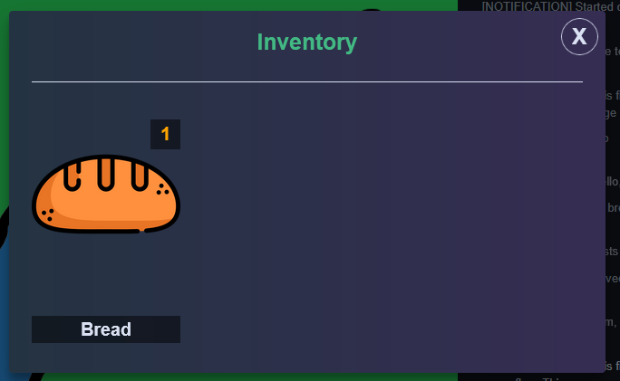
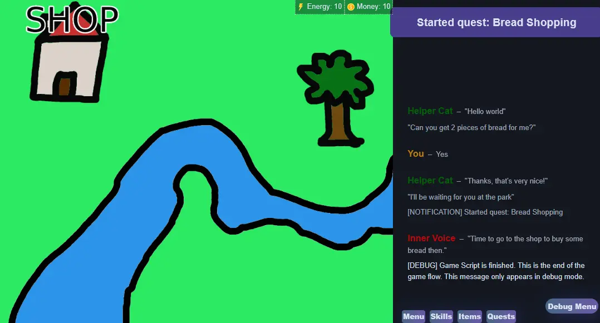

# Inventory

The inventory system allow players to collect and spend items. There is also a UI for viewing the inventory.

Possible items can be defined in the `items.yaml` config file.

```yaml
items:
  bread:
    name: Bread
    description: A bread in the game.
    icon: img/items/bread.webp
    onUse:
      action: jump
      label: eat_bread
  book:
    name: Ominous Book
    description: An ominous book.
    icon: img/items/book.webp
    onUse:
      action: run
      label: read_book
    tag: always_interactable
```

The location of `items.yaml` is set in `config.yaml`:

```yaml
items: data/items.yaml
```

Then items can be added/removed in scripts:

```narrat
main:
  add_item bread 15
  remove_item bread 10
  $if this.items.bread.amount > 0:
    talk helper idle "You have %{items.bread.amount} bread"
  else:
    talk helper idle "You have no bread"
```

## Using items

Items can also be used, see guide below:

[items.md](../features/items.md)




