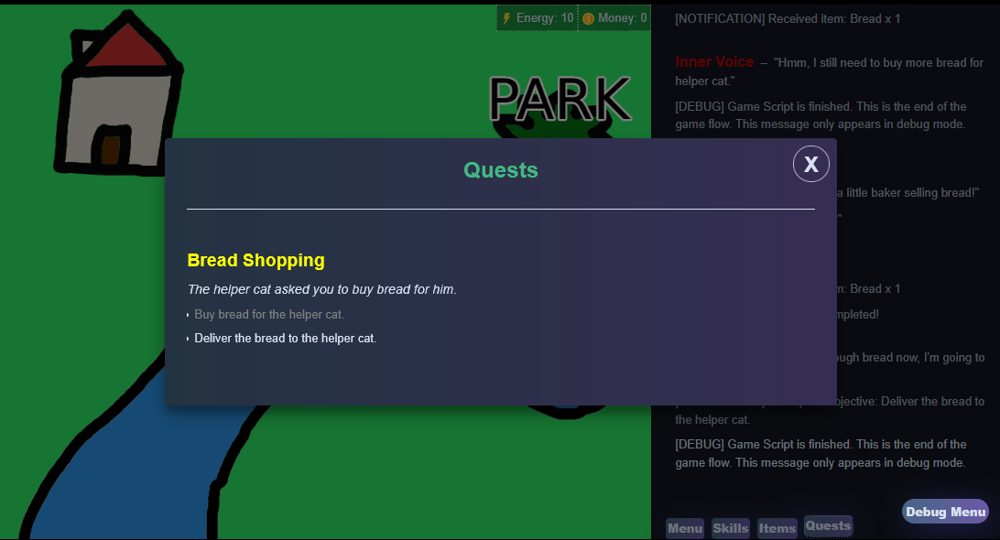

# Quests

Narrat games can have quests with dynamic objectives and a quest log UI



## Basic usage

Quests can be defined in the quests.yaml config file:

```yaml
quests:
  breadShopping:
    title: Bread Shopping
    description: The helper cat asked you to buy bread for him.
    objectives:
      bread:
        description: Buy bread for the helper cat.
      delivery:
        description: Deliver the bread to the helper cat.
```

The path of `quests.yaml` can be customised in the main config file:

```yaml
quests: data/quests.yaml
```

Scripts can interact with the quest system:

- Start Quest: `start_quest breadShopping`
- Start objective: `start_objective breadShopping delivery` (for hidden objectives)
- Complete objective: `complete_objective breadShopping bread`
- Complete quest: `complete_quest breadShopping`

::: details Example demo script

```narrat
quest_demo:
  set_button shopButton true
  set_button parkButton false
  jump bread_quest

bread_quest:
  choice:
    talk helper idle "Can you get 2 pieces of bread for me?"
    "Yes":
      talk helper idle "Thanks, that's very nice!"
      talk helper idle "I'll be waiting for you at the park"
      jump bread_start
    "No":
      talk helper idle "Oh, okay"
      jump quest_demo

bread_start:
  start_quest breadShopping
  talk inner idle "Time to go to the shop to buy some bread then."
  set_screen map
  set_button shopButton true

shopButton:
  set_screen default
  "You visit the bread shop"
  talk shopkeeper idle "Hello, I'm a little baker selling bread!"
  set data.breadPrice 5
  jump shop_menu

parkButton:
  choice:
    talk helper idle "Ah, so do you have my bread?"
    "Yes!" $if this.items.bread.amount >= 2:
      talk helper idle "Thanks a lot!"
      complete_objective breadShopping delivery
      complete_quest breadShopping
    "No :(":
      talk helper idle "Oh okay"
  set_button parkButton false

shop_menu:
  choice:
    talk shopkeeper idle "So, do you want some bread?"
    "Buy bread (costs %{data.breadPrice})" $if this.stats.money.value >= this.data.breadPrice:
      add_item bread 1
      $if this.data.breadPrice === 5:
        add_stat money -5
      else:
        add_stat money -4
      jump map_update
    roll bread_haggle haggling 50 "Try to haggle for bread" hideAfterRoll:
      success "You explain that helper cat needs bread to feed his poor family":
        set data.breadPrice 4
        talk shopkeeper idle "I guess I can sell you bread for 4 coins"
        jump shop_menu
      failure "You try to pity trip the shopkeeper but he won't bulge":
        talk shopkeeper idle "The price is 5 coins, nothing less, nothing more."
        jump shop_menu
    "Exit":
      jump map_update

map_update:
  $if this.items.bread.amount >= 2:
    complete_objective breadShopping bread
    talk inner idle "I've got enough bread now, I'm going to go to the park."
    start_objective breadShopping delivery
    set_screen map
    set_button parkButton true
    set_button shopButton false
  else:
    talk inner idle "Hmm, I still need to buy more bread for helper cat."
    set_screen mapjs
```

:::

## Quest success or failure and dynamic quest text

Quests can also be marked as succeeded or failed. This can be useful if you want some of your quests to have a bad ending, or events that can be missed, etc.

It is possible to create a custom quest description for succeeded or failed quests, so that the quest description text will change when the player has finished it.

```yaml
quests:
  breadShopping:
    title: Bread Shopping
    description: The helper cat asked you to buy bread for him.
    succeededDescription: You bought bread for the helper cat!
    failedDescription: You didn't buy bread for the helper cat.
    objectives:
      bread:
        description: Buy bread for the helper cat.
      delivery:
        description: Deliver the bread to the helper cat.
```

Then, in narrat scripts you can make the quest succeed or fail when completing it:

```narrat
main:
  var succeeded false
  complete_quest breadShopping $succeeded
```

Passing true will mark the quest as succeeded, false will mark it as failed. The description will update to the success/fail description if they exist.

::: info
Note: Quests are marked as succeeded by default when completed if you don't pass any second parameter to `complete_quest`
:::

::: tip
The `quest_succeeded?` and `quest_failed?` commands are available to check if a quest succeeded/failed
:::

## Quests with multiple endings

Building on the success/failure option for quests, you can also specify any arbitrary endings you want to create. For example:

```yaml
quests:
  breadShopping:
    title: Bread Shopping
    description: The helper cat asked you to buy bread for him.
    objectives:
      bread:
        description: Buy bread for the helper cat.
      delivery:
        description: Deliver the bread to the helper cat.
    endings:
      boughtBread:
        success: true # This indicates that this ending is considered a success
        description: You bought bread for the helper cat!
      didntBuyBread:
        success: false # This indicates that this ending is considered a failure
        description: You didn't buy bread for the helper cat.
      bakingObsession:
        success: true
        description: You decided to get really into baking and learned to make sourdough. You gave some to the helper cat who was really happy that you made it yourself.
```

And in scripts, endings can be specified as follows:

```narrat
main:
  complete_quest breadShopping bakingObsession
```

::: tip
Some commands available for quest endings:

- `quest_ending? breadShopping`: Returns the id of the ending the quest finished with, if any
- `quest_has_ending? breadShopping bakingObsession`: Returns true if the quest finished with the specified ending
  :::
