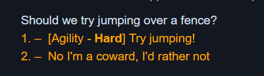

# Skills System

## Skills Introduction

A narrat game can have any number of skills which the player can gain xp and levels for.

Those skills can then be used in skill checks in two ways:

- In a dialog choice, some choices can trigger a skill check with different outcomes depending on success or failures
- Skill checks can also happen passively as conditions in the script to trigger extra content. In those cases, a message appears in the dialogue informing the player that a skill check has just happened, but it wasn't initiated by an intentional player choice.

## What it looks like

 Passive Skill check

The difficulty of the skill check depends on a combination of how hard the skill check is configured to be, and the level of the player in this particular skill

Skill check in a choice:




## Skills configuration

Skills are configured in `skills.yaml`:

```yaml
skills:
  agility:
    name: Agility
    description: How good you are at moving around.
    startingLevel: 0
    icon: img/skills/agility.webp
    hidden: true
  logic:
    name: Logic
    description: How good you are at solving problems
    icon: img/skills/logic.webp
    hidden: true
    startingLevel: 0
  haggling:
    name: Haggling
    description: Get the best prices!
    icon: img/skills/logic.webp
    startingLevel: 1
skillOptions:
  xpPerLevel: 10
  notifyLevelUp: false
```

The path of `skills.yaml` can be customised in the main config file:

```yaml
skills: data/skills.yaml
```

Each skill needs to have a name, description, startingLevel, and icon (for display in the skills screen).

The `hidden` option is an optional way to make a skill stay hidden in the skill screen until it reaches level 1. This allows keeping a skill hidden from the player if its existence is a spoiler until it is unlocked.

### Skill options

The `skillOptions` object contains global options about skills in general.

- `xpPerLevel` option, which defines how many XP points a player needs to gain to level up in a skill. XP is currently linear and the same for all skills
- `notifyLevelUp`: If not set to false, players leveling in a skill will make a notification appear in the game

## Skill Checks

The skill checks config is defined in `skillchecks.yaml`:

```yaml
options:
  diceRange: [1, 6] # Dice rolls will be between those 2 numbers, inclusive
  diceCount: 2 # How many dice are rolled by default on skill checks
  extraPointsPerLevel: 1 # How many extra points to your rolls are given per level in the skill
  extraDicePerLevel: 0 # How many extra dice the player gets per level in the skill (Default 0)
  successOnRollsBelowThreshold: false # Inverts the skillcheck behaviour so that success is when the roll is *below* the difficulty threshold
  showDifficultyText: true # Whether to show the difficulty text on the skill check
  showDifficultyNumber: true # Whether to show the difficulty number on the skill check
  showDifficultyWithoutModifiers: false # Whether to show the original difficulty without modifiers applied on the skill check
  totalRollIsHighest: false # Uses only the highest roll to do the final skill check comparison, instead of adding up all rolls
  totalRollIsLowest: false # Uses only the lowest roll to do the final skill check comparison, instead of adding up all rolls
  failOnRollsEqualToThreshold: false # [OPTIONAL, default true]: If this option is on, rolls will fail if they're equal to the score to beat. Otherwise they will succeed. This effectively makes it use `>` instead of `>=` for the comparison.
  difficultyText: # Text to show for each band of difficulty level
    - [2, 'Very Easy']
    - [4, 'Easy']
    - [6, 'Medium']
    - [8, 'Hard']
    - [10, 'Very Hard']
    - [11, 'Extremely Hard']
    - [12, 'Near Impossible']
skillChecks:
  testDicePool:
    skill: agility # skill id
    difficulty: 6 # score to beat during rolls
    winsNeeded: 2 # [Optional] How many rolls need to beat the score (uses total of all rolls if this option isn't present)
    hideAfterRoll: false # [Optional] Whether to hide the skill check from options after it happened once
    repeatable: false # [Optional] Whether the skill check can be repeated if failed
```

## System explanation

Skill checks work in the following way:

1. The engine generates dice rolls (the amount of dice and their range is configured per game). All the rolls get added up as a final score
2. The skill check's difficulty value is compared to the total dice roll. For example a skill check with a difficulty of 6 means that the total dice roll needs to be above 6.
3. Each level the player has in the corresponding skill adds extra points to their roll, that are multiplied by the `extraPointsPerLevel` value from the config (default: 1 per level)
4. Each skill check has its own `id` which allows the engine to save the state of each skill check

For more info, see the [Narrat forum dice-based skill checks development thread](https://narrat.discourse.group/t/proposal-for-dice-based-skill-checks/24?u=liana)

Practical example:

```
roll aSkillCheck agility 8 "Try jumping!":
```

This skill check uses the agility skill. It has a difficulty of 8.

Let's say the dice roll gives us 2 and 3. The player's level in agility is 3, and `extraPointsPerLevel` is 1, so 3 gets added to the total roll. This means the total roll of the player is 2 + 3 + 3, 8.

Because the difficulty was set to 8 and the result is above or equal to 8, the skill check succeeds.

::: tip
The `difficultyText` config array specifies a list of thresholds and the corresponding difficulty text to show when the skill check's difficulty is past that threshold. It can have any amount of thresholds with any values. The choice for which text to print takes into account the player's current skill level and multiplier to reflect the real difficulty, so a higher level player would potentially see a different text.
:::

## Usage syntax

### Passive skill check

```
  if (roll someSkillCheck agility 40): // You can use skillchecks in conditions
    "This line only appears if you passed a hidden passive skill check"
```

Passive skill checks are done by calling the `roll` function inside an `if` command.

See the [roll function documentation](../commands/skills-commands/roll.md) for more info and a list of options

If the skill check succeeds, the branch inside the if command will be run. A message will also be printed in the dialogue to inform the player that a skill check happened.

#### Active skill check (in choices)

```
choice:
    "Should we try jumping over a fence?"
    roll fenceJump agility 70 "Try jumping!" hideAfterRoll:
      success:
        "You graciously jump over a fence, hair blowing in the wind, and land in a heroic pose that would be used in a movie trailer."
        talk inner idle "Woo I did it!!!"
      failure:
        "You try jumping over the fence, but not high enough. You stab your toe against the fence and fall head first into a puddle of mud. It's also in the background of a tiktok a passerby was filming now."
        talk inner idle "Ouch!"
    "No I'm a coward, I'd rather not":
      "Well okay then"
```

Active skill checks happen in a `choice` command, as one of the options the player can choose.

The syntax is `roll [skillCheckId] [skillId] [difficulty] [promptText] [optional mode] [optional if condition]:`

The options are the same as the roll function, except there is a `promptText` option before the optional `mode` option.

- `promptText` is the text that will appear as the prompt for that choice
- Afterwards is the optional `mode` (`repeatable` or `hideAfterRoll`) option

Then, there is a `success` branch and a `failure` branch inside the roll. The engine will go to one of those depending on the result.

## Advanced skill checks config

Due to the amount of possible options for skill checks, there is a way to configure individual skill checks outside of scripts in the config. For example in `skillchecks.yaml`:

```yaml
options:
  # ...
skillChecks:
  mySkillCheck:
    skill: agility
    difficulty: 8
    winsNeeded: 2
    hideAfterRoll: false
    repeatable: false
```

Then, in the script, for a passive skill check:

```
if (roll mySkillCheck):
  "This line only appears if you passed the skill check configured above"
```

Or for an active skill check in a choice (this one also uses a condition with the skill check to decide if the option should appear!)

```
choice:
    "Should we try jumping over a fence?"
    roll mySkillCheck "Try jumping!" if ($data.allowedToJump):
      success:
        "You graciously jump over a fence, hair blowing in the wind, and land in a heroic pose that would be used in a movie trailer."
        talk inner idle "Woo I did it!!!"
      failure:
        "You try jumping over the fence, but not high enough. You stab your toe against the fence and fall head first into a puddle of mud. It's also in the background of a tiktok a passerby was filming now."
        talk inner idle "Ouch!"
    "No I'm a coward, I'd rather not":
      "Well okay then"
```

## Gaining levels and XP

To make the player gain xp or levels, there are two commands: `add_level` and `add_xp`. Example:

```
add_level agility 1
add_xp agility 3
```

### Resetting a skill roll

[reset-roll.md](../commands/skills-commands/reset-roll.md)
