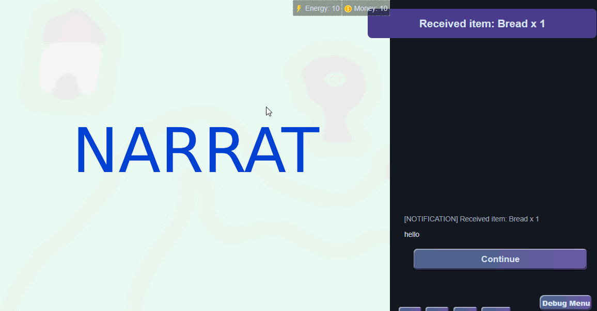

# Transitions

Transitions can be used to animate the change between two screens when using the [set_screen ](../commands/left-side-viewport-commands/set-screen.md)command

## Usage Example

```narrat
transitions_test:
  set_screen default
  "normal set screen"
  set_screen map
  "set screen with fade"
  set_screen default 0 fade // fade is the name of the transition to use
  "set screen with duration"
  set_screen map 0 fade 2000 // Make transition last 2 seconds
  "set screen with duration and delay"
  set_screen default 0 fade 2000 4000 // Make transition last 2 seconds and have the new screen be delayed by 4 seconds
```

::: tip
Note: Specifying the layer is necessary when using transitions.
:::

## Available transitions

Currently, there are two transitions available:

### fade



### slide-right


## **Creating custom transitions**

It is possible to define custom transitions by creating css classes for them. For example, here are the CSS classes for the current transitions:

**Fade transition**

```css
.narrat-transition-fade-enter-active,
.narrat-transition-fade-leave-active {
  transition-property: opacity;
  transition-timing-function: ease;
  transition-duration: 0.3s;
}

.narrat-transition-fade-enter-from,
.narrat-transition-fade-leave-to {
  opacity: 0;
}
```

**Slide-right transition**

```css
.narrat-transition-slide-right-enter-active,
.narrat-transition-slide-right-leave-active {
  transition-property: transform;
  transition-timing-function: ease;
  transition-duration: 0.3s;
}

.narrat-transition-slide-right-enter-from {
  transform: translateX(-100%);
}
.narrat-transition-slide-right-leave-to {
  transform: translateX(100%);
}
```

New transitions can be created by copying those CSS classes (and changing the name like `fade` or `slide-right` in them) and adding them to the game's CSS, editing the values to whatever is desired.

### Default transition durations config

Transitions can also have an optional config to change their default duration and delay. In `config.yaml`, for example:

```yaml
transitions:
  slide-right:
    duration: 100
    delay: 5000
```

If no config is provided, the default duration is 0.5s, and the default delay is 0 (the old and new screens effectively transition at the same time).

The order of priority for choosing the duration or delay is: what's passed in the script --> If none, use the default for that command provided in the config --> if none, use the global default
