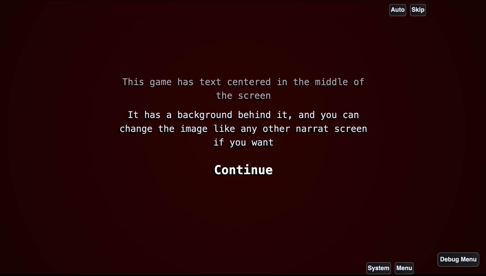

# {{ $frontmatter.title }}

{{ $frontmatter.description }}

## Quest-ce qu'un thème Narrat ?

Les thèmes Narrat sont des packages qui peuvent être utilisés avec le `NarratThemesPlugin` pour changer au vol l'apparence du jeu. Un thème est composé des éléments suivants :

- Une feuille de style `css` (voir [Guide de personnalisation de l'interface](./customising-ui.md) pour apprendre à personnaliser l'interface avec du CSS)
- Un fichier de thème, qui définit le nom du thème, quel fichier `css` utiliser, et peut facultativement fournir une liste d'options de configuration à modifier

<video controls="controls" src="./themes/narrat-themes.mp4" type="video/mp4" autoplay="true"></video>

## De quoi sont capables les thèmes ?

Les thèmes permettent de faire les choses suivantes :

- Charger de nouvelles feuilles de style CSS pour modifier la disposition de l'interface, l'apparence, les couleurs, etc. de tous les éléments
- Modifier au vol des options de configuration. Ceci permet de modifier plus ou moins n'importe quel élément dans n'importe lequel de vos fichiers de configuration en chargeant un thème qui modifie la valeur que vous désirez modifier. Par exemple, un thème peut changer la configuration du panneau de dialogue ou des éléments visuels
- Passer de l'un à l'autre à n'importe quel moment lors d'une phase de gameplay, permettant aux jeux de totalement changer leur apparence (par exemple, vous pouvez avoir un thème qui affiche le texte en grand sur un fond noir, un thème pour afficher le texte dans une petit boîte de dialogue en bas de l'écran, et un thème qui affiche le texte dans une grande boîte de dialogue en haut de l'écran, et passer de l'un à l'autre quand vous le désirez)

## Comment utiliser les thèmes ?

C'est très simple ! Utiliser un thème revient à importer l'objet `Theme` dans votre fichier `index.ts`, et à en faire usage dans vos scripts. Voici un exemple :

Créons un fichier `theme.ts` dans notre dossier `src`, afin de garder le code de nos thèmes au même endroit.

Nous allons utiliser l'un des thèmes pré-inclus dans Narrat pour cet exemple.

```ts
import { registerPlugin, NarratThemesPlugin, funTheme } from 'narrat';

export function setupMyThemes() {
  // Setup the narrat themes plugin (should only be done once)
  const narratThemesPlugin = new NarratThemesPlugin();
  registerPlugin(narratThemesPlugin);
  // Add a theme
  narratThemesPlugin.addTheme(funTheme);
}
```

Puis, dans votre fichier `index.ts`, vous n'avez qu'à invoquer `setupMyThemes`:

```ts
// Top of the file
import { setupMyThemes } from './themes'; // [!code ++]

// Rest of the file

window.addEventListener('load', () => {
  if (useSteam) {
    registerPlugin(new SteamPlugin());
  }
  setupMyThemes(); // [!code ++]
  startApp({
    configPath: 'data/config.yaml',
    debug,
    logging: false,
    scripts,
  });
});
```

Votre thème est désormais prêt à être utilisé. Dans votre script `narrat`, vous pouvez changez le thème quand vous le voulez :

```narrat
main:
  "Let's change theme"
  change_theme narrat-fun-theme
  "Now we're using the fun theme!"
```

## Thèmes pré-inclus actuellement disponibles

### Texte seul

Ce thème est basé sur le [Jeu démo Narrat texte seul](https://github.com/liana-p/narrat-examples/tree/main/text-only)




Il s'agit d'un thème qui rend la boîte de dialogue transparente et la centre sur l'écran. 

Ce thème est exporté en tant que `textOnlyTheme` dans narrat. Son identifiant est `narrat-text-only`.

```ts
import { textOnlyTheme, NarratThemesPlugin, registerPlugin } from 'narrat';

export function setupMyThemes() {
  const themes = new NarratThemesPlugin({
    themes: [textOnlyTheme],
    defaultTheme: 'narrat-text-only',
  });
  registerPlugin(themes);
}
```

## Forcer la modification de la configuration des thèmes pré-inclus

Certains thème étendent la configuration (pour changer la forme du panneau de dialogue, par exemple). Vous pouvez modifier ceux-ci dans votre jeu. Par exemple :

```ts
import { textOnlyTheme, NarratThemesPlugin, registerPlugin } from 'narrat';

export function setupMyThemes() {
  // Change the `dialogPanel` value of the extended config
  textOnlyTheme.extendedConfig.dialogPanel = {
    // Take the original values
    ...textOnlyTheme.extendedConfig.dialogPanel,
    // But override the width and height
    width: 500,
    height: 300,
  };
  // Or, for setting individual values you can just do:
  textOnlyTheme.extendedConfig.dialogPanel.width = 500;
  const themes = new NarratThemesPlugin({
    themes: [textOnlyTheme],
    defaultTheme: 'narrat-text-only',
  });
  registerPlugin(themes);
}
```

## Comment créer un thème ?

Pour créer un thème, créez simplement un dossier pour votre thème dans le dossier `src`. Pour cet exemple, appelons-le `my-theme`.

Ce dossier contiendra votre fichier css et votre fichier de thème. Céez le fichier `my-theme/styles.css`:

```css
body {
  color: red;
  font-size: 50px;
}
```

Puis, créez le fichier `my-theme/index.ts`:

```ts
import { Theme } from 'narrat';
// We import our CSS file. Note that the `?inline` part in the path is important.
import MyThemeCSS from './styles.css?inline';

export const myTheme: Theme = {
  css: MyThemeCSS,
  // The id is how the theme will be referred to in your narrat scripts
  id: 'my-theme',
  default
  extendedConfig: {
    // In this example, we're using the extendedConfig option to change the size and position of the dialog panel. You can override any values in the config in this extendedConfig option.
    dialogPanel: {
      width: 900,
      height: 720,
      rightOffset: 150,
      bottomOffset: 0,
    },
  }
};
```

Dans votre jeu, vous pouvez alors importer et ajouter le thème, comme fait dans l'exemple précédent :

```ts
import { registerPlugin, NarratThemesPlugin } from 'narrat';

export function setupMyThemes() {
  // You can setup your list of themes directly as you create the narrat plugin if you want
  const narratThemesPlugin = new NarratThemesPlugin({
    themes: [myTheme],
    // We can also give a default theme to the plugin
    defaultTheme: 'my-theme',
  });
  registerPlugin(narratThemesPlugin);
}
```


