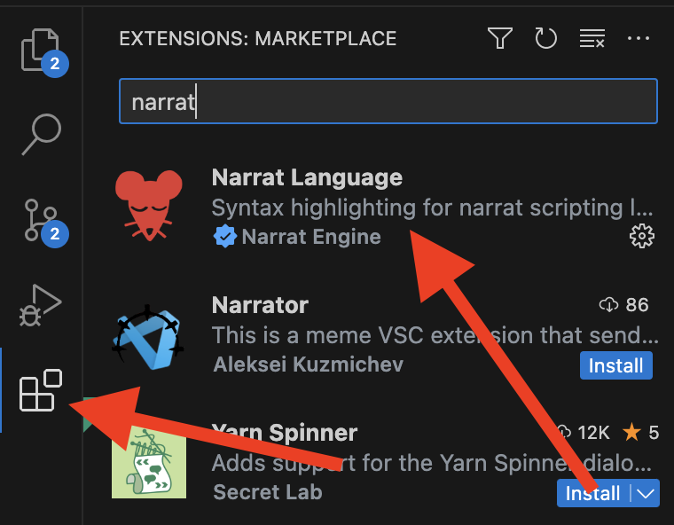

# Editing a narrat game

There are two types of content to edit to make a narrat game:

- Dialogue scripts: `.narrat` files that contain the branching narrative of the game
- Config files: `.yaml` files that contain config data about the game

## Opening the narrat project and getting ready to edit files

**A narrat game is just a folder with files in it**. To start editing your game, open that folder in your text editor (VS Code).

1. Open VS Code
2. In "File" menu, click "Open Folder"
3. Choose the folder of the narrat game you created
4. Now you can browse the files.
5. A lot of the files may not be relevant to you and you don't need to worry about them outside of advanced usage.
6. Most of the files you're interested in will be in the `public/data` folders (where assets and config are), and the `src/scripts` folder (where code and narrat scripts are)


::: tip
Install the [Narrat Language](https://marketplace.visualstudio.com/items?itemName=NarratEngine.language-narrat) Visual Studio Code extension to get pretty syntax highlighting when editing narrat scripts.

VS Code should prompt you to install it when you open a narrat game. If not, click on the Extensions button on the left, then type "Narrat" in the search bar and install the extension.


:::

## What's in a narrat game?

The following sections will explain what folders and files are important to know about to edit your narrat game.

## `public` folder

The assets (image, music etc) and config files are inside the `public` folder from the root of the game. This public folder is a folder for static assets which will be added to the final build.

Any image, config file, or other asset that the game needs to load outside of code will be in this folder.

::: tip
Assets in the public folder can be referred via their path from that folder. For example in css, to use an image that is in `public/img/button-background.png`, you would use `/img/button-background.png`.
:::

## `src` folder

The `src` folder is where scripts live. There are TypeScript files to setup the engine (which you won't normally need to edit), and more importantly in the `script` subfolder are the `.narrat` script files that make up your game.

::: info
For advanced uses, it is also possible to change code itself or integrate plugins, which also would be in the `src` folder.
:::

## Narrat scripts

[example-narrat-script.md](../examples/example-narrat-script.md)

Narrat scripts are the main way a game is created. They contain the flow of the game and lines of dialogue. The [narrat scripting language](../scripting/language-syntax.md) is specifically made for narrat.

In the `src/scripts` folder of the game, there is a `game.narrat` file (or named differently depending on which template you used). This is where the actual game dialogue is written. The example dialogue there shows how to use a few basic features, so you can easily start writing your own dialogue. Just above is a link to the example narrat script page to find more examples as needed.

## Importing scripts

All the narrat scripts used in a game are imported and listed in `src/scripts.ts`. If you want to add or remove narrat scripts from your game, import them at the top of that file and remember to add or remove them from the list of scripts exported at the end of the file.

::: tip
You can make your entire game in a single script file if you want, but it's useful for organisation to separate it into multiple files. Just remember to import them like below
:::

Example `scripts.ts`:

```ts
import demo from './scripts/demo.narrat';
import quest from './scripts/quest.narrat';

export default [demo, quest];
```

Narrat scripts are in a custom language nade for narrat, see the [language syntax guide](../scripting/language-syntax.md) page for more info.

::: tip
We advise using [Visual Studio Code](https://code.visualstudio.com) for editing narrat scripts. There is a [Narrat Language VS Code extension](https://marketplace.visualstudio.com/items?itemName=NarratEngine.language-narrat) which will give you great syntax highlighting.
:::

See the [language syntax guide](../scripting/language-syntax.md) to learn more about how to edit narrat scripts.

## Example scripts

There are a number of [example narrat scripts](../examples/example-narrat-script.md) available. Reading through their `.narrat` script files can be a good support for finding out how to do various things.

## Config files

There are various config files in narrat games which allow to extensively customise how the engine behaves.

By default, games ship with a default config so you don't need to do anything. As you start using more features, you will need to edit the config as needed.

## config.yaml

The config file contains basic info about the game. In it are defined images, screens, buttons, musics, skill checks, items, quests and more.

More info about the config files in the [Config Files guide](config-files.md)

## characters.yaml

The `characters.yaml` file contains the config for all characters that can speak in the game. They should all at least have a name value, and an `idle` sprite. The sprite is used for displaying character portraits during dialogue, and the value should be a file path relative to the `imagesPath` value defined in the config part of this file

The color character names appears as can be changed with the `color` value in the `style` property of the character (the value can be any valid CSS color).

## What next?

Making a game is simply a matter of editing those files to write the game you want. To know more about available features, look at the left sidebar of this documentation website to see pages about all the features and guides on specific things.

::: tip
Many features get added to narrat frequently and some aren't documented yet but explained in the changelog. See the "Updating narrat" page below for more info.
:::

[updating-narrat.md](updating-narrat.md)
