# {{ $frontmatter.title }}

Narrat is a game engine for narrative games. Under this broad umbrella, narrat can help you create many sorts of games, but it's particularly good for games based on stories with choices, and games with TTRPG mechanics.

## Elements of a Narrat game

Let's examine a screenshot of the test narrat game to see what elements are in it. Note that actual games might have completely different looking UIs, and this is just the default layout.

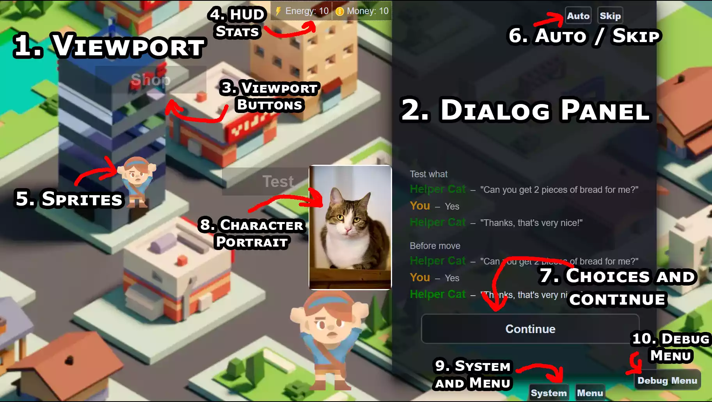

The following picture is a screenshot of a testing game with a few generic elements representing common narrat features.

::: tip
Click on an element in the list to jump to the relevant section.
:::

1. [Viewport](#viewport)
2. [Dialog Panel](#dialog-panel)
3. [Viewport Buttons](#viewport-buttons)
4. [HUD Stats](#hud-stats)
5. [Sprites](#sprites)
6. [Auto/Skip](#auto-skip)
7. [Choices and continue](#choices-and-continue)
8. [Character Portrait](#character-portraits)
9. [System and Menu](#system-and-menu)
10. [Debug Menu](#debug-menu)

### Viewport

This is where the visuals of the game are displayed. It normally takes the entire screen of the game, while the dialog panel sits on top of it.

The viewport displays the current **screen** of the game. Each screen has a background (image or video), and can contain buttons or sprites.

Learn more about the viewport in the [Viewport Guide](../features/viewport.md)

### Dialog Panel

This is where the story and dialogue of the game is displayed. Most of the player interactions take place here, as this is where the player makes choices and advances the story.

Learn more about the dialog panel in the [Dialog Panel Guide](../features/dialog-panel.md)

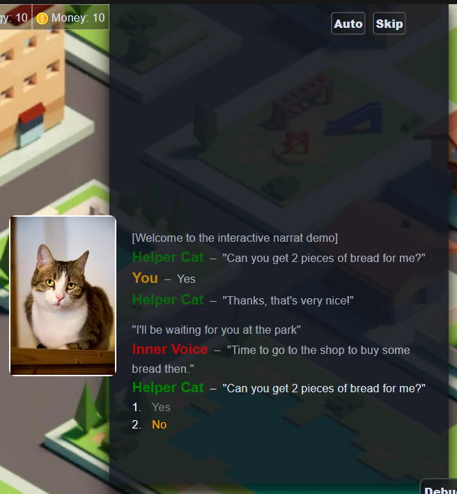

### Viewport Buttons

Viewport screens can have buttons on them, which can be used to make things happen when the player clicks on them. Buttons can either be made of just text, or have a background image.

Learn more about viewport buttons in the [Buttons section of the viewport guide](../features/viewport.md#screens-config)

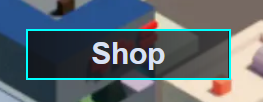

### HUD Stats

A Narrat game can define various "HUD Stats", which are numbers that get tracked and displayed in a special way on the screen. This allows easily creating UI for things like health, money, etc.

Learn how to use them at the [HUD Stats](../features/hud-stats.md) page

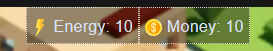

### Sprites

Sprites are similar to buttons, but dynamically created during the game via narrat scripts. While buttons are completely static and tied to a specific screen, sprites are more versatile, but a bit more complex.

Learn more at the [dynamic sprites and text guide](../features/dynamic-sprites-text-objects.md)

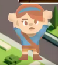

### Auto / Skip

Narrat games have auto/skip buttons, as is common in visual novels. The auto button will automatically advance the story, while the skip button will skip to the next choice or end of the script.

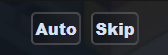

### Choices and continue

The area at the bottom of the dialog panel is where the player will get to make choices or continue the story. Most of the interaction with the game happens here

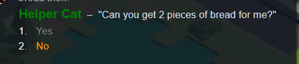

### Character Portraits

When a character is talking, they have a portrait displaying next to the dialog panel. There can be different characters with different poses for talking, each pose being able to use a different image

Learn more at the [character and portraits](../features/characters-and-portraits.md) page.

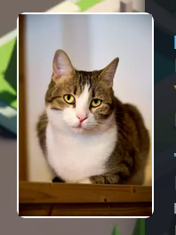

### System and Menu

The system button opens a menu with generic system settings, while the Menu button opens a menu for interacting with some game features, like: Inventory, Skills, Quests and Achievements

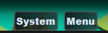

#### System Menu

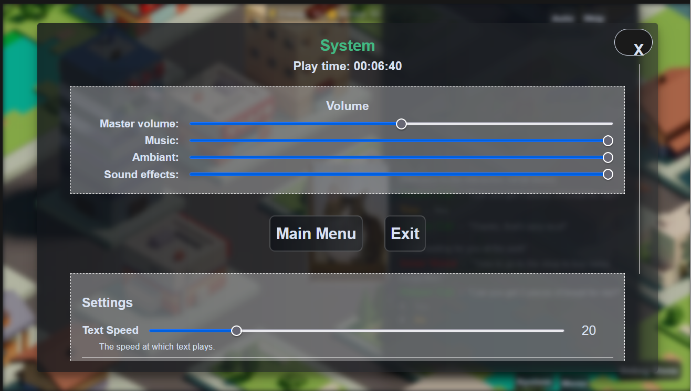
This menu shows various system options

#### Menu

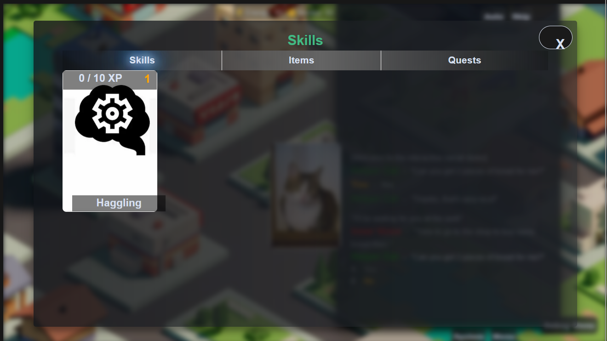
This menu enables access to various game features:

- [Inventory](../features/inventory.md)
- [Skills](../features/skills.md)
- [Quests](../features/quests.md)
- [Achievements](../features/achievements.md)

### Debug Menu

This button only appears in debug mode (it is removed automatically in builds), and gives access to various tools to help debug your game.

::: tip
You might want to know about the [Troubleshooting guide](../troubleshooting/troubleshooting.md) guide when it comes to debugging too!
:::
