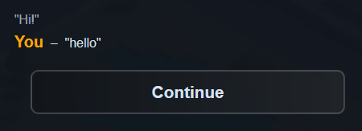

# Macros

## What is a macro?

A macro in narrat is simply a custom command that you can define in a config file. It allows making up your own syntax for writing scripts, or creating shortcuts for commands you use often. Here's an example:

_macros.yaml_

```yaml
macros:
  - keyword: t
    label: lazy_talk
    options:
      - name: character
        type: string
      - name: text
        type: string
  - keyword: p
    label: lazy_player_talk
    options:
      - name: text
        type: string
```

_game.narrat_

```narrat
lazy_talk character text:
  talk $character idle $text

lazy_player_talk text:
  talk player idle $text

main:
  t helper "Hi!"
  p "hello"
```

Result: 

## How to use macros

As seen in the example above, to create a macro you need two things:

- A macro definition in the macros.yaml config file
- A narrat label for the macro to run

### macros.yaml

Add a `macros.yaml` file to your game, like with other optional config files, by creating `macros.yaml` in `src/config`, and adding it to your list of config files:

```ts
import achievements from './achievements.yaml';
import animations from './animations.yaml';
import audio from './audio.yaml';
import buttons from './buttons.yaml';
import characters from './characters.yaml';
import choices from './choices.yaml';
import common from './common.yaml';
import items from './items.yaml';
import quests from './quests.yaml';
import screens from './screens.yaml';
import skills from './skills.yaml';
import skillChecks from './skillchecks.yaml';
import tooltips from './tooltips.yaml';
import macros from './macros.yaml'; // [!code focus]
import { ModuleConfigInput } from '@/config/config-input';

const defaultGameConfigs: ModuleConfigInput = {
  achievements,
  animations,
  audio,
  buttons,
  characters,
  choices,
  common,
  items,
  quests,
  screens,
  skills,
  skillChecks,
  tooltips,
  macros, // [!code focus]
};
export default defaultGameConfigs;
```

Then, in `macros.yaml` you can add a macro. The `macros` field of `macros.yaml` is an array of macros, and the options for a macro are:

```yaml
macros:
  - keyword: t
    label: lazy_talk
    options:
      - name: character
        type: string
      - name: text
        type: string
```

- `keyword`: The keyword that will trigger the macro in your narrat script. This is the name of your custom command. For example, in the example above, the keyword is `t` for the `lazy_talk` macro.
- `label`: The narrat label to run when the macro is used.
- `options` [optional]: Those are the arguments of the macro. It's an array which should have one element for each option the label to run can receive:
  - `name`: The name of the option.
  - `type`: The type of the option (possible values are string, number, boolean, any, rest)
  - `optional` [optional]: Whether the option is optional or not. Defaults to false. Only the last option can be optional.

The `options` list informs the narrat compiler of how many arguments your command expects and their type. This helps the compiler show warnings when starting the game if the command is used incorrectly. If `options` isn't passed, the compiler will assume the command has no arguments.

Once the macro has been defined, and the label to run has been defined, you can use the macro in your narrat script:

```narrat
lazy_talk character text:
  talk $character idle $text

test_macros:
  t myCharacter "Hi!"
```

Here, the `lazy_talk` label is run by the `t` macro, with the arguments `myCharacter` and `"Hi!"`.
