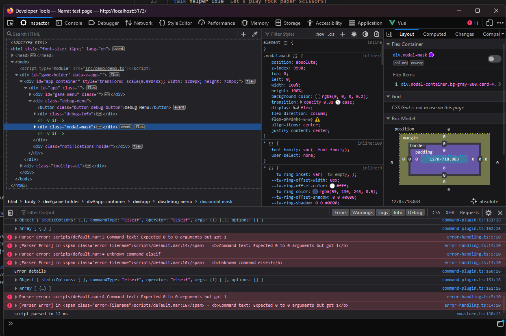
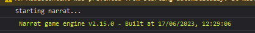
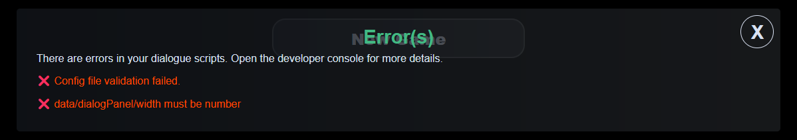
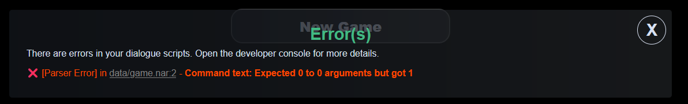
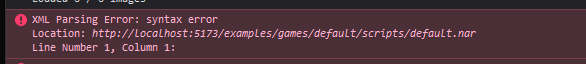

# How to get help

Please create a thread on the [help forum](https://narrat.discourse.group/c/help/5) with as much information as you can, including: Any logs if relevant, narrat version, browser used, description of the issue, and what you've attempted. You can also ask for help [on Discord](https://discord.gg/Xgz7EQ2Xgh) if it's a small thing, but the forum is preferred as it's easier to keep track of issues and other people who have the same issue will be able to find that thread in the future.

# How to debug errors

Most errors on startup come from the script compiler, which usually means there is a syntax error in your script. The error box will usually tell you what the error is, but sometimes unexpected errors can happen which don't have a helpful error message. This is where more advanced troubleshooting is needed.

## Opening the browser developer tools

If you right click on the page and click "inspect" (on Chrome or Firefox), it will open the dev console. The usual shortcut for that is ctrl+shift+J.

### The console

The `console` part of the devtools is where errors will appear. It can help find hints about issues. If the errors you find are obscure javascript error and don't help you, you can try asking for help in the narrat discord, preferably with screenshots or copy paste of all error messages you found.

## Check which version of narrat is running

Near the top of the logs in the browser console should be a log indicating which specific version of narrat is running and when it was built.

Make sure this is the version you're expecting, and if you ask for help please include this information.

### The network tab

Sometimes errors can be caused by a file not loading (a typo in a path for example). Looking in the network tab of the dev tools (you might have to click reload) can help see if any assets are failing to load.

## Errors in the terminal when building the game

If you get errors in the actual terminal when building the game, it means something is wrong with your local setup. Possible options:

- Have you run `npm install`?
- Try deleting the `node_modules` folder and running `npm install` again (this is where all the dependencies are installed).
- `npm` warning about security can be ignored (see below)

## Errors in the game itself or in the browser console

Those errors happen when running the actual game and will appear directly in the game's screen, or sometimes only in the browser console

If you see an error **when booting the game**, it likely means your narrat script files couldn't compile properly or your config has issues. The error message should help figure out which file is wrong. If not, you'll need to [ask for help](#how-to-get-help).

If your error happens while playing through the game, then it's a runtime error where something went wrong. It can be an issue in your scripts that broke the game, or potentially a bug in the engine. Again, look for any helpful logs, and if lost, [ask for help](#how-to-get-help).

Some examples:

This type of error means that a value in your config is invalid. The error message should tell you which part of the config is invalid. You just need to fix the config to match the correct format. If unsure, ask for help and include your config

This type of error means that there is a syntax error in your script. The error message should tell you which narrat file and specific line is wrong. Sometimes the error may not be on the exact same line as it can be caused by a mistake higher up in the file, but it should give you a general idea.

A common reason for script mistakes is having an incorrect level of identation somewhere. Another one (as in this screenshot), is using a command with the wrong type or amounts of parameters.

### Native JavaScript error

Sometimes you might see an error in the console that refers to JavaScript code and may be harder to understand. This means that something unexpected errored in the engine and narrat doesn't have a specific error message for it. In this case, you can try to figure out what the error message is saying, or ask for help.

## Game not launching or missing images after creating a build with electron

The most common cause for this is having paths in the CSS that don't start with `/`. For example it should be `background-image: url("/img/image.png")` and not `background-image: url("img/image.png")`.

## My index.html file doesn't work!

You can't open the `index.html` file created by a build directly, it needs to be hosted on a server. This is because the game loads various files (images and narrat scripts for example), and [browser security policies](http://kb.mozillazine.org/Links_to_local_pages_do_not_work) don't allow web pages to load files directly from your hard drive. You can use a local server to host the game, or upload it to a web server (for example it will work when releasing a game to itch.io).

If you want an easy way to launch a local web server to test your built html game, simply go in the `dist` folder where your built game is in the terminal, and run the command `npx http-server`. This will install and run a lightweight server that lets you access your game.

## Using `+`, `&&` and things like that isn't working properly

Most likely issue is that you're trying to use operators like in most common programming languages (for example `if (something && somethingElse)`). But the in the narrat scripting language everything is a command, including operators. This means that the previous example should actually be `if (&& something somethingElse)`. Or for example `set data.sum (+ 1 (* 2 2))` which in this case would result in 5 (1 + 2 \* 2). Support for operators syntax might be added in the future, but for now you have to use the command syntax as the scripting language is similar to a [lisp language](https://www.tutorialspoint.com/lisp/lisp_operators.htm).

## My electron build isn't updating properly

Remember that the game needs to be built before running on electron by running `npm run build`. The `npm run electron` command only starts electron, but doesn't build your game.

You can use `npm run desktop` as a shortcut command to first build your game and then open electron.

## Errors that can be ignored

::: tip
The following errors can be safely ignored and aren't relevant
:::

### XML Parsing error in the dev console

Those XML parsnig errors on narrat files can be ignored. For some reason, Firefox is trying to parse narrat files as an XML file. It doesn't do anything.

### Security warnings on install

Security warnings from npm when installing a game can be ignored. They come from the npm audit system, which is a very flawed system that flags development tools as being exploitable, even though they're never exposed to users, making those errors irrelevant to their actual use case. More background info on this [here](https://overreacted.io/npm-audit-broken-by-design/).
