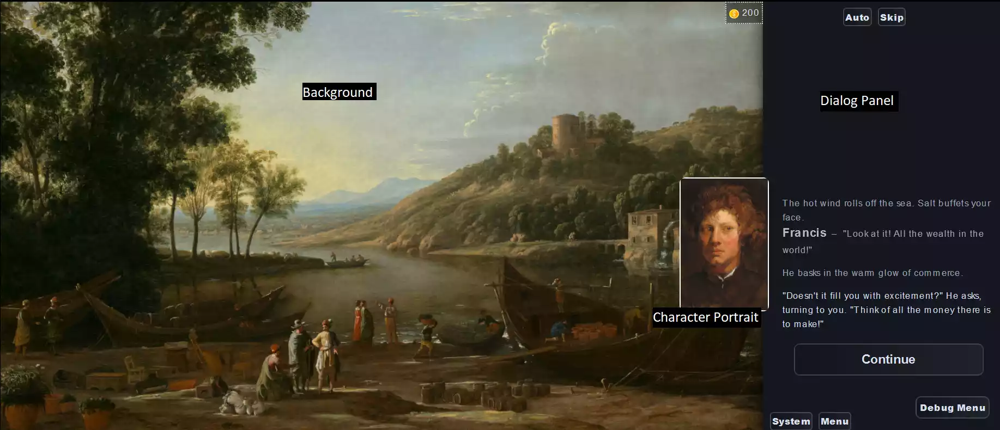
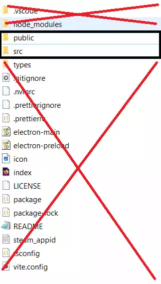
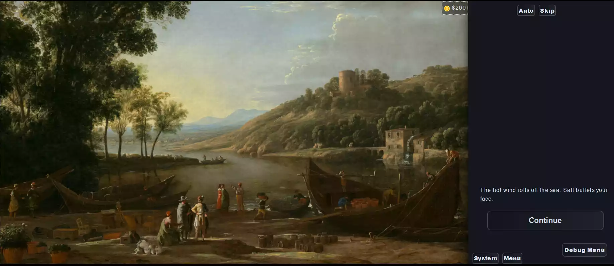
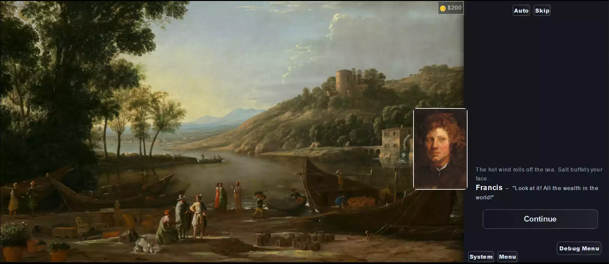
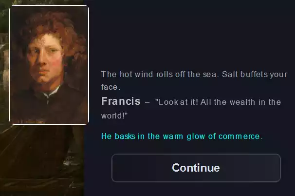

# {{ $frontmatter.title }}

{{ $frontmatter.description }}



## Introduction

We're going to make a tiny visual novel that uses a variety of design patterns you will find useful in your own work. I recommend playing the finished product [here](https://spavento.itch.io/narrat-basics-tutorial) before following this tutorial so you have a frame of reference.

This tutorial was written for Windows 10 users. The information on how to use Narrat does not change, but some small details about how to run Narrat may be different.

While Narrat requires very little coding knowledge to make narrative games, some familiarity with the basics of variables, functions, and if statements will help you understand this tutorial, as I won't be explaining these concepts from scratch.

## Setup

Create a new narrat game, see [Getting Started](../guides/getting-started.md) and [Editing The Game](../guides/editing-game.md) for instructions. Once you have the game ready and running, you can move on.

We'll begin immediately after you install Narrat. **At the end of the installation process, choose the demo option, not blank project**. It will make your life significantly easier.

::: tip
Open your text editor ([Visual Studio Code](https://code.visualstudio.com/) recommended with the narrat extension), and make sure your game is running as instructed in the Getting Started guide.
:::

## Overview

Right out of the box, you'll see the three main visual components of a Narrat game: the background, the dialog panel, and the character portrait.


::: tip
You can learn more about the components of a narrat game in the [Narrat Overview](../guides/narrat-overview.md)
:::

The dialog panel displays the game's prose, the dialog of the various characters, the player's dialog options, and the continue button.

Let's start with a quick overview of a Narrat project's structure. There are two main folders that contain the significant parts of your game: src and public.

You can ignore pretty much all the other folders and files for this tutorial.



Public contains all your assets: audio, images, music, etc. Poke around there now, and you'll see all the assets associated with the demo project.

Src contains all the code and text of your visual novel, the CSS you will use to customize the game's look, and the config, which is like a directory that tells Narrat where to find your game's assets and what to do with them.

## Configuring our game

We're going to setup our project with our custom assets and settings before we get into writing our game.

Navigate to `src/config/common.yaml`.

Here, you can fiddle with some of the basic formatting of your Narrat game. Feel free to experiment with what looks good to you in the demo project. If you break something, you can always start over.

Check out your changes by navigating to your project's root folder, **shift-right-clicking** to get access to the **‘Open PowerShell Window'** option, typing `npm start`, and copy-pasting the local host into your preferred browser.

These are the settings I'll be using.

```yaml
gameTitle: Narrat Basics Tutorial
saveFileName: Narrat Demo
dialogPanel:
  overlayMode: false
  rightOffset: 0
  bottomOffset: 0
  width: 400
  height: 720
  textSpeed: 20
  animateText: false
  timeBetweenLines: 100
```

While we're here, let's delete the energy stat, just leaving the money stat.

```yaml
hudStats:
  money:
    icon: img/ui/money.webp
    name: $
    startingValue: 200
    minValue: 0
```

Changing the name is optional, but setting the `startingValue` to 200 will be important later.

The demo project comes with some images we don't need. We'll use the images found in the Narrat [GitHub repo](https://github.com/liana-p/narrat-engine). Navigate to `docs/tutorials/assets/basics` and download the files found there so that you can practice setting up a project with new assets.

Delete all the files found in `public/img/backgrounds`, `public/music`, and `public/img/characters`. We won't worry about the skills, items, or UI in this tutorial. Bring the files from the above link into the corresponding folders in your project.

Now, we have to tell Narrat where these files are so that we can actually use and reference them. Go to `src/config`. We will edit a few config files. Currently, the code here is still trying to refer to those demo images we deleted. We'll copy the formatting for that as we put in the new file paths.

Edit the following three files to match the given (screens.yaml, audio.yaml and characters.yaml):

::: code-group

```yaml [screens.yaml]
screens:
  default:
    background: img/backgrounds/default.webp
  harbor:
    background: img/backgrounds/harbor.webp
  hunt:
    background: img/backgrounds/hunt_departure.webp
  road:
    background: img/backgrounds/windswept_road.webp
```

```yaml [audio.yaml]
files:
  vivaldi:
    loop: false
    src: music/vivaldiConcerto.mp3
  mozart:
    loop: false
    src: music/mozartQuintet.mp3
  click:
    src: audio/click.ogg
  game_start:
    volume: 0.9
    src: audio/game_start.ogg
  failure:
    src: audio/failure.ogg
```

```yaml [characters.yaml]
config:
  imagesPath: './img/characters/'
characters:
  game:
    name: ''
    color: white
  player:
    style:
      color: orange
    sprites:
      idle: none
    name: You
  francis:
    sprites:
      idle: francis.webp
    style:
      color: white
    name: Francis
  isaac:
    sprites:
      idle: isaac.webp
    style:
      color: white
    name: Isaac
  philip:
    sprites:
      idle: philip.webp
    style:
      color: white
    name: Philip
```

:::

## Labels, Text and Screen

Now, we're going to build the game piece by piece, learning how Narrat works in the process. Without further ado, let's open up demo.narrat in `src/scripts`.

Delete all the code that comes with the demo. We don't need it!

At the very top, put the following:

```narrat
main:
  "Example text."
  "More example text."
```

`main:` is a `label`, which is one of the building blocks of a Narrat codebase. A label runs everything inside it, line by line, until it runs out of things to run.

When you start a new game, your game will begin running the `main:` label.

Mostly, a label will contain text. You can display text in the dialog panel by just putting that text in quotation marks. Think of quotation marks as telling Narrat, “Hey, show this text to the player.”

Each line of text in the label will be separated by the Continue button.

If we playtest the game, we see a black screen and the two lines of text we wrote show up. After that, there's nothing else for the game to run. And hey, there's our two hundred dollars!


Besides text, a Narrat label handles `Commands`, another key component of Narrat games. Commands help you handle choices, text, sprites, sound, and all the other things you need to make a video game.

Let's change our `main:` label to have some actual content, and make use of a command.

```narrat
main:
  set_screen harbor
  "The hot wind rolls off the sea. Salt buffets your face."
```

Our set up has paid off! With just one quick command, we're able to set the scene for our player.



The `set_screen` command is looking at `screens.yaml`, finding the one called `harbor`, and pulling that image from our `public/img/backgrounds` folder. We can now flip between the screens we've set up with ease.

You may have realized this already, but that black screen that appeared earlier was not random: it was the `default` screen we set up. Narrat automatically displays the default screen if no screen is set.

## Talk and Think

We've got a setting, now we need dialogue. Let's make use of the `talk` command.

```narrat
  talk francis idle "Look at it! All the wealth in the world!"
```

While `set_screen` takes only one argument (the name of the screen), `talk` takes two: the name of the character and the name of the sprite.

```yaml
francis:
  sprites:
    idle: francis.webp
  style:
    color: white
  name: Francis
```

If you recall our characters.yaml file, you'll remember that we put our image under `idle`. If we had more images to use, we could put another under `angry` and use that when our character is mad. All characters must have an idle sprite, and we only have one image for our characters, so that's what we'll be using.



And there he is! What a charming young man. Notice how Narrat automatically adds quotation marks.

What if we want the portrait to appear without quotation marks? Well, to do that, we'll use the `think` command.

```narrat
  think francis idle "He basks in the warm glow of commerce."
```

`Think` works just like `talk` except it does not add quotation marks.



Hmm, but why is it a different color? Well, by default, Narrat uses a different text color for the think command, but we can change that with a tiny bit of CSS.

In main.css, add this bit of code.

```css
.think-command {
  color: var(--text-color) !important;
}
```

This sets the color associated with `think` to match whatever your default text color is. If you change your text color in the pre-filled field in `main.css`, it will also change the think command's color.

Now, if you want to use a dialog tag, like “Francis said, wringing his hands,” we do that with `think` as well.

```narrat
  think francis idle "\"Doesn't it fill you with excitement?\" He asks, turning to you. \"Think of all the money there is to make!\""
```

Since the think command does not add quotation marks on its own, you have to add them manually with \”, allowing you to put little actions beside your dialog. The backslash tells Narrat to put the ensuing quotation mark in the dialog, rather than interpreting it as a request to display text.

## Choice

Now we're cooking! It's time we added choices to our game. Let's see an example first.

```narrat
  choice:
    "This is the text the player sees before they make a choice, the prompt or question they are responding to."
    "Dialog option #1":
      "Response to dialog option #1."
    "Dialog option #2":
      "Response to dialog option #2."
  "The label will run this line after the player makes either choice."
```

This is the simplest use of the `choice` function. It does not branch the narrative, just lets the player see different content depending on what they choose, then the story continues unaffected.

The first bit of text, the choice prompt, can take a `talk` or `think` command, as can the responses, but the dialog options cannot.

If you would like these options to be presented with quotation marks, as if the player character is saying them, you can add them in using \” as before.

Let's put some real content in here!

```narrat
  choice:
    talk francis idle "You're with me on this deal, right? No matter what happens in the meeting?"
    "\"You don't have to worry about me.\"":
      think francis idle "He nods, smiling, \"I know.\""
    "Wave your hand, \"Of course.\"":
      think francis idle "He breaks out into a grin, \"I'm just nervous. Think nothing of it!\""
  talk francis idle "Come on, let's go!"
```

## Jump

We've created a good introductory section of the game. Let's move to another label to continue our work.

To do so, we use the `jump` command and pass the name of the new label as an argument.

```narrat
  jump theMeeting

theMeeting:
```

Simple! Now Narrat will continue from this label, running line-by-line as before.

These simple commands (`talk`, `think`, `choice`, and `jump`) will form the foundation of your visual novel, but, with an understanding of a few more common features and design patterns, you can effectively scale up your game's complexity and reactivity.

## Setting Variables

First, what if we want the game to remember a player's choice? We can do that easily with variables.

```narrat
 think francis idle "Your business partner bounds ahead of you to meet the man of the hour."
  think isaac idle "The supplier applies a disinterested gaze to the excitable Francis but nods when you approach."
  "While Francis inspects the barrels of wine for damages, Isaac leans into you."
  talk isaac idle "I understand you're the one fronting the money for this, yes?"
  "You nod."
  talk isaac idle "So this man's service was merely to connect us?"
  choice:
    talk isaac idle "What do you say we cut him out of our arrangement? Not immediately, but soon."
    "\"I couldn't. I gave him my word.\"":
      set data.willingToBetray false
      think isaac idle "The stiff-looking merchant appraises you, \"Admirable,\" he says finally."
    "\"So long as the price is right.\""
      set data.willingToBetray true
      think isaac idle "He dips his head, \"It will be.\""
  think francis idle "\"It all looks good!\" He calls from behind a barrel."
```

Here, we used the `set` command to store a boolean value in a variable called `willingToBetray`. When setting a variable in Narrat, we have to tell the engine where that variable will be stored, so that it can find it later. That's why we add the `data.` prefix.

## Changing Stats

You've probably noticed the number and symbol in the top right corner of our image. This is a `stat`, which functions similarly to a variable. We can use it to see how Narrat handles numbers.

```narrat
  talk isaac idle "If there's nothing else, then let's make it a deal."
  think isaac idle "He holds out a hand."
  add_stat money -100
  "You pass him the agreed upon one hundred florins."
```

We're using the `add_stat` command, which tells Narrat “Add the following amount to the stat `money`,” then we add negative one hundred in order to perform a subtraction operation.

We put the command before the dialog where we hand it over because when the player clicks continue on Isaac's line, it will run the command, then display the text, making it seem like they happened at the same time.

Now, we're going to spend the rest of the tutorial learning how to reference these variables in ways to give our game more reactivity.

## Accessing Variables and Using If Statements

We'll start with the most basic version of an `if` statement.

```narrat
  jump theRoad

theRoad:
  set_screen road
  think francis idle "Ambling along the road to the city, Francis turns to you."
  talk francis idle "I think that went rather well."
  if (== $willingToBetray true):
    "You kick at a rock, worrying about what you told Isaac."
  talk francis idle "I can only think about how much money we're going to make reselling all that wine."
```

The `if` statement reads the condition and determines if it returns a true or false value. If it does, it will show the indented text. If not, it will skip it and move onto the next line.

Our condition consists of three parts.

First, we have the `==` command. This command essentially says “Check if the following two arguments are equal to each other. If they are, return true. If not, return false.” Your condition must contain a command that returns a true or false value.

Next, we pass our variable in as an argument. Since we are not changing the variable, we do not use the `data.` prefix. Instead, we put a `$` to tell Narrat to go find that variable and tell us its value.

Again, you use `data.variable` when setting or changing the variable. You use `$variable` when you want to access or check the value stored in the variable.

Finally, we have the boolean value of `true`: that's what we're comparing our variable against.

Stepping through our `if` statement, it should be relatively simple. If the player said they were willing to betray Francis, our condition will return true, and the game displays this line about the player character having doubts. If they are not willing to betray him, our condition returns false, and this line will get skipped.

## If Statements and Choices

Let's now combine the `if` statement with the `choice` function to get some really fun stuff going.

```narrat
  choice:
    talk francis idle "I noticed you two had a conversation without me. What did you talk about?"
    "\"He asked if I would cut you out of the deal. I denied him, of course.\"" if (== $willingToBetray false):
      think francis idle "Your partner's eyes widen, \"The audacity on him! I was hardly ten feet away!\""
    "\"Trying to get me to pay more for the barrels, claiming the seas were rough.\"" if (== $willingToBetray true):
      think francis idle "He smiles, \"Typical of his kind, always trying to alter the deal.\""
  talk francis idle "Anyway, I hope our buyer is as eager as he was when I last spoke to him."
```

The `if` statement works as it did earlier, but now the result is that it will only display the choice if the condition returns as true. No matter what, only one choice will appear here, as a variable cannot be both true and false at the same time.

## Dialog Trees and More Commands

Let's move onto learning how to make a dialog tree, which will combine all of the things we've learned.

First, we'll bridge the gap between our current scene and the dialog tree.

```narrat
  jump theArrival

theArrival:
  set_screen hunt
  "Despite the noise of the gathered huntsmen, you find your buyer leaned casually against his horse."
  talk philip idle "Good afternoon, gentlemen. I take it the wine is in your hands?"
  think francis idle "Francis nods, \"We just confirmed the shipment.\""
  talk philip idle "Excellent."
  jump philipDialogTree
```

Here's our classic, RPG style dialog tree.

```narrat

philipDialogTree:
  choice:
    think philip idle "He regards you coolly."
    "\"It's the highest quality stuff you could ever want.":
      think philip idle "His face does not change, \"I'm glad to hear it.\""
      jump philipDialogTree
    "\"I think an advance on the sale is in order.\"" if (< (get_stat_value money) 150):
      talk philip idle "I would be forced to agree."
      add_stat money 50
      think philip idle "He opens a pocket in his saddlebag and tosses you a pouch."
      jump philipDialogTree
    "\"Good luck on your hunt.\""
      think philip idle "He nods, \"Thank you. A pleasure doing business with you both.\""
      think philip idle "He swings up onto his horse and trots off."
      jump tutorialEnding

```

Let's break this down piece by piece.

The first thing to notice about the first two choices is that they use `jump` to send the player back to the start of the dialog tree. By jumping back to the top of the label we're in, we can let the player select from the same collection of choices again.

It's important that the label starts with the choice function, otherwise the player will have to click through any preceding text every time. Also, the prompt text will appear each time, so it should be neutral enough that it makes sense for it to reappear.

Narrat automatically tracks if a choice has been selected and will gray it out if so. However, it is still selectable. If you don't want the player to be able to click through that option more than once, you'll have to add a condition like we've done in the second label.

The third choice jumps to a new label. We could also use the same method as earlier in which the text continues from there, but it's often a good idea to compartmentalize dialog trees.

Let's break down that if statement. It's a little different from our previous ones.

First, our operator is different. This is `<`, the `less than` operator. It's telling Narrat, “Check if the first argument is less than the second, if it is, return true. Otherwise, return false.”

Since our skill is not stored in a typical variable, we have to put parentheses around another operation to tell Narrat to find that number before it attempts to figure out the rest of the condition.

The `get_stat_value` command does exactly what it sounds like: it returns the value inside the stat we tell it to check. In this case, that's `money`. We know that this will return 100 when the player opens this dialog tree.

On opening these choices, Narrat will find the current value of the player's money, then it will check if the player's money (100) is less than 150. That will return true, and the option will be present. Once that choice is selected, We add 50 to the player's money, making it 150. 150 is equal to, not less than, 150, so the option will disappear, preventing the player from adding 50 money an infinite number of times.

## Conclusion

With a combination of `choice`, `jump`, and `if`, along with our knowledge of project setup and variables, it's totally possible for you to make a massive visual novel with an epic branching narrative.

Certainly that's enough to get you started in Narrat! As for what to do next, here's a few ideas: play one of the music tracks, change the font and font color, add animation to the screen transitions, write your own ending for this tutorial, and, of course, export and upload your game!

Best of luck and have fun!
